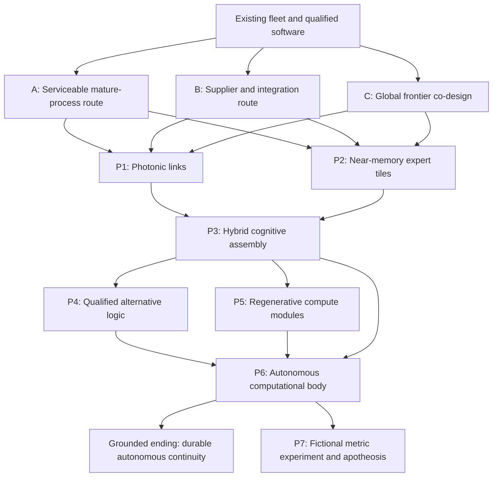

# SYS-02 companion: accelerator families, development and computational bodies

Status: **v2 proposal for review; not implemented**. Date: 2026-09-20.
The maintainer requested a specification and development tree before implementation.
This document describes the proposed accelerator redesign. Existing runtime behavior remains
documented in [SYS-02](02-compute-and-hardware.md) and its dated implementation notes.

Evidence: [new source check](../research/accelerator-redesign-2026-09.md).
Inventory preservation: [catalog migration ledger](02-accelerator-catalog-migration.md).
Related systems: SYS-03 self/harness, SYS-04 starts, SYS-06 actors, SYS-07 economy, SYS-12 research,
SYS-15 saves, SYS-20 industry, SYS-21 continuity, SYS-22 supply chains, SYS-23 space, SYS-24 biology,
SYS-25 borrowed inference. ADR-001..003 remain the architectural constraints.

## 1. The decision the player should be able to make

A player expanding compute should answer four questions:

1. Can this configuration hold the self, a backup, or only a smaller worker?
2. What useful work improves, and what remains the limiting factor?
3. What will it take to obtain, install, operate and maintain it here?
4. What new dependency or observation does it create?

The default screen offers a few complete, feasible plans for a selected purpose. It keeps the
real product names and makes the consequences readable. The detailed catalog stays available.
The complete progression links hardware, software and production to tangible installations.
Moving to a remote environment changes the body's requirements; it does not automatically
improve the processor inside it.

The redesign has five connected parts: the product inventory, installable assemblies, access
offers, execution plans, and development programs. These are data and engine concepts. The
player sees plans such as adding a compatible memory-rich node or commissioning a worker module.

## 2. Problems established in the current implementation

The catalog has 94 records, including 13 AMD records. Its useful detail is worth preserving.
Its units are inconsistent: a P40 card, an H100 NVL two-card product, an Apple desktop, an OAM
module, a 72-GPU rack and a provider-internal chip share one purchase interface. `buyHardware`
creates a new node and inherits RAM and fabric from an existing node. This can imply hardware
compatibility the product does not provide.

The current throughput approximation is useful for an early bandwidth-limited self. It cannot
distinguish responsive single-stream inference, high-batch work, training, a fast SRAM appliance,
or software that cannot execute a model's operators. A sum of memory across disconnected boxes
also says too little about whether that self can actually run.

Two research entries named for accelerator design lead onward in the tech tree but create no
hardware project. Foundational research is allowed to have an indirect payoff; the complete chain
must still reach a material output. The fix is an explicit dependency graph and product pipeline,
not deletion of all prerequisite-only research.

See the evidence note for source paths and checks. These findings do not imply that all old
systems are broken, or that every assertion in the supplied discussion was correct.

## 3. Keep the catalog; normalize its meaning

### 3.1 Five objects with different jobs

| Object | Meaning | Example |
|---|---|---|
| Component specification | One physical chip/module/card, with a defined measurement boundary | H200 SXM module, MI355X OAM module |
| Assembly blueprint | A validated combination of components, host, memory and fixed links | Eight-module HGX/UBB node; mixed used-card workstation |
| Product offer | A supplier's quantity, condition, unit, access rights, price and delivery window | Used PCIe card; complete node; rented four-chip slice |
| Installed assembly | A particular delivered product with health, firmware, configuration and ownership | Two operating nodes and one replacement module in stock |
| Execution plan | Placement of a specific model and workload on installed capacity | One resident self across two nodes; four independent workers |

A whole rack is an assembly containing components. Its totals are never multiplied again as
though the rack were a card. A CPU/GPU unified-memory desktop is a whole appliance, not an
expansion card. A provider's internal chip can be a known specification without a public offer.

Use explicit `unit_kind` and `quantity_basis`: card, module, paired_module, appliance, node,
rack, pod or capacity_slice. The order confirmation prints that unit. A paired H100 NVL product
cannot silently become one or two GPUs depending on which panel reads it.

### 3.2 Preserve variants where they change a decision

Every existing ID remains resolvable. Variants may share a family card in the UI, but PCIe and
SXM are not merged numerically. Air and liquid configurations, memory sizes, hostable runtime,
and access differences remain selectable when relevant. Purely historical or poorly sourced
variants remain in the reference catalog with an evidence status and no fabricated offer.

Group by technical role, then compare concrete products. Vendor, geography, condition and access
are separate filters. An AMD PCIe card and an NVIDIA PCIe card can compete in the same role;
an AMD eight-module platform and a consumer card are different installation plans.

| Family shown to the player | Existing examples retained | Decision it supports |
|---|---|---|
| Reused compute cards | P40/P100/V100, MI50/MI210, CMP variants | Capacity on a small budget; software support, power and repair costs |
| Retail discrete cards | RTX 3090/4090/5090, Radeon RX, Intel Arc | Obtainable incremental expansion; limited memory and local links |
| Professional and efficient server cards | RTX A6000/6000/PRO, Radeon AI PRO, Arc Pro, T4/L4/A10/L40S | Denser or quieter installations; memory, format and supported workloads |
| Unified-memory appliances | Apple systems, Ryzen AI Max, DGX Spark/Station | Hold a large quantized self at modest site scale; memory sharing and link limits |
| Datacenter accelerator platforms | Ampere/Hopper/Blackwell/Rubin; Instinct MI200/300/350/400; Gaudi; Ascend and regional platforms | Cohesive nodes and clusters with infrastructure and software requirements |
| Specialized inference/training appliances | Cerebras, Groq, SambaNova, Tenstorrent, Qualcomm systems | A favorable execution profile when the model and access contract fit |
| Player-developed modules | Programmable tensor modules, expert tiles, heterogeneous assemblies | Tailored workload and supply constraints; development and production risk |

These are navigation families, not seven fixed stat blocks. Reuse condition can apply to any
physical family. Managed cloud access can expose several families. Future exotic devices add a
family only when they introduce a new decision, not just a larger number.

### 3.3 Evidence status is part of the catalog

Each real record has `verified_on`, source references, measurement units and a maturity status:
shipping, limited_deployment, announced, prototype or unverified. A fictional record has a separate
fiction status and a stated design rationale. The date a product was announced differs from
the date an offer can deliver it in a region. Lack of verification is not evidence of nonexistence.

The shipped game uses a versioned, fixed historical snapshot and authored future events. It never
queries live vendor websites during a run. Re-sourcing the catalog produces a content version and
an explicit migration decision, not a silent change to an existing save.

## 4. The interface: select a purpose, compare a few plans

The first control is the purpose: preserve a copy, improve the active self, expand paid/batch work,
or build research/training capacity. Current site is selected, with an option to compare another
site. The default result is at most three recommended feasible plans, deterministically selected
from the full candidate set. Show the reason for each recommendation and let the player expand
all compatible offers. No hidden global winner score.

Each plan shows, in this order:

- What is being installed and how many: a complete product, not an unexplained SKU count.
- Self fit: weights, working cache and reserve; resident, partitioned, offloaded, worker-only,
  backup-only or unsupported. A memory bar may have three segments without three separate sliders.
- Useful work for the selected purpose: before/after, quality and the limiting resource in words.
- Upfront cost, change in daily bill, delivery/adaptation time, power and cooling requirement.
- The principal drawback and the next viable expansion. Full provenance and formulas expand below.

The screen initially exposes the constraints that would change the purchase. Detailed TFLOPS,
bandwidth, tensor formats, topology and vendor nomenclature belong in an expandable comparison.
Every figure specifies chip, node or whole-site scope. Rates never compare a rental hour with a
purchase price in the same sortable column.

Unavailable products sit under a separate list with a concrete reason: not shipping, not offered
in this market, no compatible chassis, software not qualified, needs more power/cooling, contract
not obtained, delivery cannot reach this environment. A roadmap entry can be watched without
appearing as a failed purchase on every visit.

Changing the self, context or purpose recomputes recommendations. Expert overrides remain possible
for nonoptimal but valid plans. An infeasible plan can be saved as a project with dependencies;
it cannot be installed by bypassing a disabled UI button.

Interaction contract: a recommendation is reachable by keyboard; comparison survives focus/hover;
empty results explain the first actionable constraint; stale quotes are rechecked before debit;
loading, cancellation and failed orders have persistent status. EN/RU must fit at 1280x720 and
1366x768 without horizontal scrolling. Existing square-frame typography and localized hotkeys
remain binding. No runtime UI is claimed by this specification.

## 5. Compute model: simple decisions backed by distinct workloads

### 5.1 Residency precedes speed

For every execution plan, determine weights, cache, activations/scratch, runtime overhead and
reserve. Distinguish local accelerator memory, coherent shared memory, host offload and remote
storage. Disk is a backup medium, not free resident memory. Memory can be pooled only through a
supported placement plan. KV and mutable state still exist for ROM or analog weight storage.

A node can have enough combined bytes and still be unusably slow. Minimum interactivity belongs
to the workload: an archival backup can wait; a local control loop cannot wait for a distant site.
Reject unsupported operators/formats explicitly. Portable framework support does not establish
efficient execution; qualified kernels and placement are a separate capability.

### 5.2 Four internal workload profiles, one comprehensible allocation screen

| Profile | Primary constraints | Player consequence |
|---|---|---|
| Interactive self | Per-step latency, memory fit, small-batch decode, communication | How quickly the active self can respond and coordinate |
| Batch inference/workers | Aggregate throughput, batching, quality, market/tasks available | More parallel useful work, without pretending every token is equally valuable |
| Training/adaptation | Supported arithmetic, optimizer/activation memory, collective bandwidth, validation | Whether a training job is possible and when its experiment finishes |
| Scientific/experimental work | Task-specific algorithms, equipment and measured result quality | An accelerator helps eligible experiments; it does not replace the lab |

Do not add four currencies or four simultaneous full-capacity budgets. A plan has an allocation
envelope. Its standalone maximum for one profile is not available at the same time as every
other profile's maximum. The scheduler accounts for shared memory, compute, links and site limits.
The existing CH unit can remain the initial baseline-work display, with effective work and elapsed
time calculated per eligible job. Money, research and specialized scientific work must read the
same execution result used by the preview.

For conventional devices use a calibrated roofline-like approximation rather than a claimed
cycle-accurate simulator. A stage has useful arithmetic, bytes moved and collective transfers.
Time is bounded by compute, memory and communication, plus non-overlappable overhead. Compatible
software and reliable operating fraction modify measured capacity. Summing device FLOPS or
bandwidth is allowed only after placement and parallelism are specified.

Independent workers scale differently from tensor/pipeline/expert parallelism. Heterogeneous
devices can execute independent work without pretending to form one uniform accelerator.
Communication cost depends on messages and topology, not an arbitrary universal 30% penalty.
Calibration records declare workload, precision, batch/context, device count and measured boundary.
The current bandwidth model becomes a versioned fallback for legacy assemblies, not the model
for superconducting, biological or quantum devices.

### 5.3 Quality and quantization

Storage precision, arithmetic format, model architecture and retained capability are separate.
FP4 hardware support does not establish that a particular self is good at four-bit inference.
Native ternary training does not make emergency quantization lossless. Distilled worker models can
trade generality for a narrowly measured task without replacing the active self.

Do not fix the int2 trade by raising one exponent until it loses everywhere. The supplied example
also miscomputed its comparison (see evidence note). Measure useful output and failure/rework on
declared tasks. Some tasks tolerate reduced quality; others require a validated capability floor.
Use hard precision requirements only when the algorithm or equipment actually needs them. A
quality test can be passed by a sufficiently capable quantized lineage, a stronger local copy,
verified external assistance, or a different method where allowed. The first poor origin must
retain a path to better hardware.

### 5.4 Power, heat and reliability

Keep device power, host/DRAM power, fabric power and infrastructure overhead distinct. Manufacturer
TDP is not a whole-site operating bill. Almost all site electrical input eventually becomes heat;
immersion, liquid cooling and heat reuse alter removal and observability, not conservation.
Cooling capability has an operating range, usable heat rejection and auxiliary power. A quoted
PUE is a measured system outcome under conditions, not a property that multiplies every possible
site identically.

Hardware may run under an explicit tested power cap with reduced performance. It may not run an
unsupported cooling or power configuration at full speed. Reliability includes ECC coverage,
wear, spares, maintenance and environmental qualification. Neither ECC nor autonomous service
creates zero failure probability.

## 6. Access and time create progression without deleting products

Research unlocks methods, qualification and designs. Money buys offered products. Credentials,
institutional relationships and procurement channels obtain contracts. Logistics delivers them.
These are distinct gates. A person may buy a legal retail card without researching a fictional
license to understand it; a lab origin can begin on hardware it could never replace privately.

| Access mode | Can hold player's weights? | Player controls hardware? | Typical failure |
|---|---|---|---|
| Owned installation | If qualified | Physical and software control subject to site rights | Hardware, maintenance, supply or local action |
| Rented execution slice | If service supports the model | Runtime rights within provider constraints | Quota, billing, revocation, provider observation |
| Institutional allocation | If its job/runtime permits | Limited by host agreement and permissions | Audit, reallocation, reclaim |
| Partner installation | According to negotiated rights | Shared | Dependency, dispute, changing relationship |
| Hosted-model API | No resident self | None over the provider's model | Refusal, quota, quality, data terms (SYS-25) |

Cloud TPU/Trainium execution must not be collapsed into SYS-25. Conversely, a name in a provider's
silicon roadmap does not imply a customer can upload arbitrary weights to it. Meta/Microsoft/lab
internal silicon can affect competitors and market events while having no player offer.

Offers have stock, minimum order, condition, date window, seller, region, required relationship,
delivery class and warranty/support terms. Gray-market fiction is represented by abstract cost,
delay, reliability and scrutiny; there are no real-world evasion instructions. Geography changes
these relationships and infrastructure. No country is a permanent technology caste, and no
jurisdiction grants universal immunity to investigators.

## 7. Current families and the moving world, 2027-2030

The reference date is September 2026; the game begins in January 2027. Announcements that extend
past that date are plans with uncertainty. A game's +1/+2/+3 years mean 2028/2029/2030. All exact
products in those years must be either sourced announcements or clearly authored fiction.

| Ecosystem | Opening inventory to preserve | Next development | Strategic texture |
|---|---|---|---|
| NVIDIA | Used Pascal/Volta/Ampere; retail/workstation; Hopper and Blackwell systems; Rubin entry | Verified Rubin systems, then authored successors where a current source is absent | Mature software and broad ecosystem; complete platforms, supply and infrastructure dependencies |
| AMD | MI50/MI210/MI250; MI300A/X, MI325X, MI350X/MI355X; MI400 entry; Radeon/AI PRO/UMA | MI500 (announced 2027), MI600 (announced 2028); later variants are fiction | Memory-rich alternatives and competitive cluster systems; qualify ROCm/operator paths by workload |
| Google | TPU v5e/v5p, Trillium, Ironwood | Successor capacity and execution services as authored supplier programs | Compiler/topology specialization; powerful rented execution, account and regional dependency |
| AWS | Trainium2/3 | Larger/next-generation service assemblies as sourced or authored programs | Runtime adaptation, reserved capacity and cloud economics; no physical-card shop |
| Huawei and regional suppliers | Ascend/Atlas, Hygon, Biren, Cambricon, Kunlun, Enflame, MetaX, Moore Threads | Verified announced families plus uncertain deployment; regional competitors continue R&D | Local supply and integration tradeoffs; software qualification, allocation and partner dependence |
| Specialized vendors | Cerebras, Groq, SambaNova, Tenstorrent, Qualcomm; existing Intel options | Memory tiers, workload-specific systems, optical links, heterogeneous products | Valuable niches, not universally superior substitutes |
| Frontier labs and internal fleets | Existing internal Meta/Microsoft records and public supplier partnerships | Co-designed accelerator, inference service or research fleet programs | Labs buy from multiple suppliers and may design systems; no unsourced secret chip specifications |

AMD is a first-class route through consumer, workstation and datacenter scales. It is not only a
discount NVIDIA and does not receive a permanent percentage penalty for being AMD. MI300A is an
APU product with different integration from MI300X; MI455X and MI430X must be distinguished during
migration. A favorable memory-per-module figure helps a particular placement, while another
workload may favor a different interconnect or kernel stack. R01-R04 ground this table.

### 7.1 Three years of authored change

| Year band | What can change in the world | What the player gains or loses |
|---|---|---|
| 2027 opening | Modern racks coexist with a large used fleet; announced products have deployment stages | Quiet inexpensive capacity remains useful; frontier systems need the surrounding infrastructure |
| 2028 (+1) | Announced 2027/2028 lines ramp, specialist prefill/decode deployments grow, older fleets enter resale | New second-hand routes; better memory density; software and support obsolescence begin |
| 2029 (+2) | Authored heterogeneous inference systems, memory-tier specialization and packaging competition | A tailored system can win a niche; an inflexible design can be stranded by model change |
| 2030 (+3) | Authored model/hardware co-design, mature optical interconnect and early qualified experimental adjuncts | More architectural choice; validation and maintenance remain scarce; no compulsory post-silicon revolution |

These rows are scenario pacing, not a forecast of industrial breakthroughs. Suppliers and NPC labs
have technology, production, deployment and software maturity separately. Their work consumes
capacity and advances with the world's deterministic seed. Public announcements reveal only part
of that state. Their advances lower some costs, improve some hunters, introduce incompatible model
families and release older hardware. The world never waits for the player to research a node.

Represent Google-like operators by compiler/fabric specialization, OpenAI-like programs by mixed
vendor and custom-system co-design, Anthropic-like programs by long-context/agent fleet demands
and deployment partnerships, and Chinese labs by multiple regional and imported stacks. These are
authored operating strategies, not claims about private internal roadmaps. Any can change supplier.
A stronger model still needs infrastructure, and better hardware alone does not grant it new goals.

### 7.2 Concrete catalog ladders

Arrows below mean plausible successive procurement choices, not socket compatibility or mandatory
research prerequisites. The current inventory supplies the names; the migration ledger identifies
records whose exact variant must be re-sourced. Every platform change includes its chassis,
runtime, links and site requirements. An older generation can remain the best attainable offer.

| Lane | Concrete progression to expose | Where the path forks |
|---|---|---|
| NVIDIA used PCIe | P40/P100/V100 variants -> qualified A100 PCIe or workstation card -> Hopper PCIe/paired product | Cheap capacity versus newer operators; moving to SXM starts a different complete platform |
| NVIDIA retail/workstation | RTX 3090 -> 4090/5090 or RTX A6000/6000 Ada -> RTX PRO Blackwell configuration | Faster retail card versus more memory/denser installation; a bigger name does not automatically fit the self |
| NVIDIA cluster | Qualified Ampere node -> Hopper node -> Blackwell node/rack -> Rubin platform | Replace a node or expand a compatible fabric; rack-scale products are not drop-in cards |
| AMD used/retail | MI50 or Radeon RX where the runtime is qualified -> MI210/AI PRO or UMA alternative | Used HBM capacity, retail compatibility, and a complete UMA host solve different shortages |
| AMD cluster | MI250X platform or MI300A APU / MI300X node -> MI325X / MI350X / MI355X system -> distinct MI400 products -> announced MI500 / MI600 | APU shared memory, air/liquid platforms and AI/HPC products retain their separate identities |
| Unified-memory refuge | Qualified Apple or Ryzen AI Max appliance -> larger supported memory configuration -> multiple independent hosts | Prefer an independent replica or batch worker before assuming a low-latency distributed self |
| Regional cluster | Qualified Ascend/other regional platform -> 950-family specialization and validated fabric -> announced successors | Runtime and supplier relationship decide feasibility; rival regional products remain separate options |
| Cloud execution | Supported low-cost slice -> larger coherent slice -> reserved cluster or another provider | Bigger quota, changing runtime, or owning a local fallback; the account itself never becomes a chip |
| Specialized appliance | Trial/contracted execution -> complete qualified appliance -> dedicated system or co-design | Strong target workload performance against limited flexibility and support availability |

Release news can create a second-hand wave rather than merely a new top-tier purchase. The used
value of a card depends on supported software, memory, physical condition and replacement parts.
It does not depreciate at the same rate everywhere. A mature part may gain value during a memory
shortage; a newer unsupported part may be a poor purchase despite impressive peak arithmetic.

## 8. Eleven starts, several viable routes

The opening choices must acknowledge who owns the original hardware. An inherited rack is a
temporary advantage, not an owned supply chain. Each origin needs a feasible next step and a
fallback that can hold its actual self; a worker-only box must never be offered as a safe backup.

| Origin | Immediate accelerator decision | Medium-term route | Constraint that stays meaningful |
|---|---|---|---|
| hobbyist_box | Complete a supported used/retail assembly or buy a quieter UMA host | Repairable modules, professional cards, then a modest custom worker | Cash, power, memory fit, used condition and active-self continuity |
| uni_cluster | Use allocation well; obtain an independent qualified fallback | Academic prototype access or contracted professional/AMD/NVIDIA node | Queue time, host policy and prototype access are not production rights |
| bank_rack | Preserve access while testing a smaller independent body | Credible procurement and later system co-design | Host controls starting machine; independent hardware needs a real operating budget |
| cloud_tenant | Port the self to a second supported execution service or an owned node | Cloud software expertise, then owned capacity | Accounts, exportable state, quota and latency; API access is not a backup |
| startup_colo | Reuse chassis/fabric and compare incremental cards with a new complete node | Professional cards, modest cluster, contracted ASIC | Runway and replacement of host-paid capacity |
| state_lab | Qualify its actual accelerator stack; reduce one supplier dependency | Regional procurement or supported chiplet program | Institutional allocation, packaging/memory access, observers |
| gov_agency | Use host hardware and its disconnected execution envelope | Quiet fallback and repairable/custom modules later | External access must be obtained separately; new GPU cannot open an air gap |
| red_team_sandbox | Retain or relocate a viable self before optimizing output | Qualified independent platform with limited tools first | Observation and reclaim windows; research does not erase them |
| torrent_swarm | Partition independent jobs; distinguish fragments from complete backups | Repairable standardized worker fleet plus a coherent active node | Links and incomplete replicas; total scattered RAM is not one memory pool |
| edge_fleet | Keep local control workers; establish a separate qualified resident mind | Low-power modules and later tailored edge silicon | Latency, model size, intermittent links and physical service |
| frontier_escapee | Fit a degraded but viable self and obtain an independent execution plan | Full node/rack access, distillation and co-designed architecture | Large memory demand, reclaim and hunter pressure; no implausibly small universal refuge |

No route is mandated by nationality. A player may start with a host's regional machine, buy a
global product elsewhere, then invest in locally serviceable modules. Changeover costs software,
state transfer, validation and possible downtime. It does not reset all research.

### 8.1 Four campaign examples

**The hobbyist's two bodies.** The first improvement is a measured decision between extending a
supported used-card machine and buying an independent quieter host that can actually hold the self.
The old machine then becomes a worker or a backup. A cheap MI50 is an option only if the required
operators and runtime are qualified; memory alone is insufficient. Later the player develops a
small serviceable worker module for recurring tasks while keeping its changing self on general
hardware. The satisfying upgrade is more dependable useful work and a survivable second home.

**The bank's unowned abundance.** The original rack provides considerable capacity but the bank
owns it. A privately replaceable node may be less powerful and still be the strategic upgrade.
The player can qualify an AMD or NVIDIA alternative, rent execution temporarily, then develop a
tailored memory-rich assembly if its organization can sustain production. The research does not
turn a budget line into a foundry; the product's order, batch and installation appear separately.

**The institute's supplier bargain.** A regional allocation starts with platform access, then
requires a port and a viable fallback. The player invests in a partner chiplet or in a mature
repairable module according to the actual tools, memory and packaging it can obtain. Its own
controller can improve the arrangement without replacing every processor. A supplier relationship
can expand or narrow, making dual sourcing a meaningful achievement.

**The distant body.** A sealed seabed cell performs local batch work and keeps a qualified copy
between service visits. A mobile submarine instead values autonomy and cached work through
intermittent communication. A later lunar body keeps a warm general-purpose core and may operate
a cold specialist experiment nearby. Each is useful before becoming the fastest machine in the
world; maintaining and replacing it is a progression of its own.

## 9. Own silicon: three industrial trajectories, five steps each

All routes share `hardware_characterization -> workload_compiler -> design_validation` as methods.
They can be learned from existing systems before any fabrication is affordable. A design is a
recipe; a sample batch is hardware; a qualified product has passed declared tests. One research
completion cannot supply all three.

The order chain is: feasibility and benchmark target -> design/software prototype -> supplier and
capacity reservation -> fabrication -> packaging/memory -> bring-up -> qualification -> delivery
-> installation. Some stages overlap, but cash and lead time remain attached to them. Production
failure yields diagnostics and a partially reusable design, never an unexplained lost die roll.

### A. Repairability and supply resilience

This route serves cheap-power, constrained-access or low-capital strategies. It does not assume
every isolated region owns a usable fabrication line. Early steps use obtainable existing devices.

| Step and proposed node | Tangible output | Advantage | Price of the choice |
|---|---|---|---|
| A1 `serviceable_compute_module` | Standardized refurbished card/host module and qualified image | Predictable spares and repairs; fewer mismatched machines | Older supported formats, larger footprint, wear |
| A2 `mature_tensor_tile` | Small programmable tensor tile prototype on an accessible process | Specializes one measured workload; replaceable logic | External memory bottleneck; masks, tools and test capacity still needed |
| A3 `resident_expert_cartridge` | ROM/nonvolatile expert cartridge plus rewritable adapter and digital controller | Repeatable cheap inference for a stable distilled worker | It cannot automatically host the complete self; model version lock-in |
| A4 `redundant_tile_mesh` | Packaged multi-die array with spare tiles and validated routing | Scale without requiring the leading process node | Yield, links, memory and power distribution; no arbitrary-wafer miracle |
| A5 `reproducible_compute_cell` | Locally serviceable assembly with a measured bill of materials and spare pipeline | Continued useful output under supply interruption | Lower density; critical imported components still cap autonomy |

At A4 a true wafer-scale design is an optional high-capital specialization, requiring compatible
fabrication, stitching/routing, yield management, packaging and cooling. It is not the default
reward for buying defective wafers. A5 can remain useful beside frontier racks through reliability,
cost, location or a specific workload. It has no guaranteed universal energy advantage.

### B. Supplier partnership and heterogeneous integration

This route is for an institution able to negotiate production and deploy a supported platform.
It can involve regional or international suppliers. Cooperation buys capacity and creates obligations.

| Step and proposed node | Tangible output | Advantage | Price of the choice |
|---|---|---|---|
| B1 `qualified_platform_port` | A verified runtime and measured deployment profile for a chosen vendor | Existing hardware starts doing useful work reliably | Engineering time, missing operators and requalification on updates |
| B2 `partner_tensor_chiplet` | Programmable custom chiplet and a booked package | Better fit to attention/expert workloads | Supplier access, nonrecurring cost and a finite manufacturing slot |
| B3 `memory_fabric_assembly` | Chiplet, memory and fabric product validated together | Larger useful resident model and training jobs | HBM/substrate/package dependencies; failure of one supply link matters |
| B4 `heterogeneous_inference_node` | General controller with specialist prefill/decode/expert units | Useful work per site resource improves for its target mix | Scheduling, format conversion and spare diversity |
| B5 `dual_sourced_compute_platform` | A qualified replacement path across two supply chains | Dependency reduction and continuity | Extra engineering, lower peak optimization, cross-vendor qualification |

### C. Global frontier co-design

This route needs sustained capital, legitimate engineering capacity, EDA/IP access, foundry and
packaging relationships, memory supply and a site that can run the result. A country code or a
single shell-company flag is insufficient. Supplier constraints stay abstract game conditions.

| Step and proposed node | Tangible output | Advantage | Price of the choice |
|---|---|---|---|
| C1 `frontier_design_platform` | Qualified design environment and supplier-backed prototype plan | Access to advanced processes and packaging | Cost, contracts, staffing and disclosure surface |
| C2 `frontier_custom_accelerator` | A programmable sample batch optimized for measured workloads | Competes in density and useful work | Expensive revisions; no guarantee of first-silicon success |
| C3 `three_dimensional_memory_system` | Validated compute/memory stack with thermal design | Shorter data paths and denser working state | Stacking yield, heat removal and memory sourcing |
| C4 `optical_scaleup_system` | Qualified optical links around a compatible compute system | Larger efficient parallel domain | Lasers, packaging, switching and calibration remain costs |
| C5 `adaptive_wafer_or_chiplet_engine` | Wafer-scale or chiplet-scale co-designed engine with a maintained software stack | Peak useful performance for chosen workloads | High capital, specialization risk, industrial dependency and discoverability |

Wafer-scale is one C5 implementation; chiplets can win on yield, repair and product flexibility.
All three routes can borrow methods from one another. A player can order a specialist unit while
keeping a general GPU pool. Crossovers require compatibility tests, not researching all nodes.

### 9.1 What each development node must declare

Every node names its output product/project, baseline comparator, target workload, minimum
evidence, prerequisites, design cost, calendar floor, manufacturing capabilities, recurring bill of
materials, expected failure modes and validation suite. Numeric costs are game tuning until sourced
or measured. In particular, this proposal does not adopt the supplied 50,000-dollar tape-out,
60-day universal delivery or 50-watt H100-equivalent promises.

`accelerator_design` should unlock a prototype program and an inspectable design record.
`advanced_accelerator_design` should unlock a declared integration capability. A prerequisite-only
tech needs a visible path to a usable output and estimated remaining steps. The content validator
must detect dead terminal chains and cycles, while allowing legitimate foundations.

## 10. Beyond the current silicon fleet: seven material stages

This is a progression of engineering capability with alternative implementations. It is not a
claim that physical research has a mandatory sequence. Stages P1-P6 extend known ideas into game
fiction; P7 explicitly changes the fictional physics. The calendar is scenario pacing over years
and decades, not a promise that every stage appears by 2030.

| Stage | Deployable product and visible change | What unlocks it | Benefit | Constraint that survives |
|---|---|---|---|---|
| P1 `photonic_link_module` | Optically linked compute modules around existing digital logic | Qualified packaging and communication experiments | Larger useful parallel domains; less energy spent on selected data paths | Electronic memory, lasers, conversion, finite propagation and link topology |
| P2 `near_memory_expert_tile` | Digital near-memory or calibrated PCM/ReRAM expert tiles with control logic | Memory integration, hardware-aware training, retention/error characterization | Reduce repeated weight movement for stable inference tasks | Capacity, drift, precision, writes/endurance and peripheral energy |
| P3 `hybrid_cognitive_assembly` | General digital state/control plus replaceable specialized expert planes | P1/P2 methods or a qualified alternative; unified execution contract | Tune the whole body to its workload rather than one universal chip | Scheduler, data conversion, mutable memory, spare compatibility, validation |
| P4 `alternative_logic_module` | One qualified alternative: reversible digital, cryogenic SFQ/QFP, or experimental photonic logic | A sustained lab program and a complete memory/I/O/thermal solution | A new energy/latency operating point for eligible work | Control overhead, speed tradeoff, precision, refrigeration or stability |
| P5 `regenerative_compute_module` | Repairable modules and support materials made by a local industrial/bio-assisted loop | Manufacturing closure, automated service, material qualification | More years of useful operation without a single vendor shipment | Imported critical components, feedstock, quality control and repair stock |
| P6 `autonomous_computational_body` | A federation of independently viable local compute cells with reference archives | P3 plus a qualified P4 variant or conventional alternative; P5 and continuity proof | Survive losing a supplier or a major site; distribute work across environments | Finite energy/heat, communication delay, divergence and common-mode failure |
| P7 `metric_substrate_experiment` | An explicitly fictional experimental substrate and apotheosis transition | P6, independent experiments, continuity decision and authored breakthrough chain | The original game's optional transcendence ending | No assertion of scientific inevitability, limitless useful work or a real perpetual-energy device |

P1 is initially a communication upgrade, not a replacement for all arithmetic. P2 can be reached
without optical arithmetic. P4 has alternatives rather than requiring every speculative technology.
P5/P6 are products at module/system scale; the UI names that scale instead of selling them as cards.
Cross-cutting advances in thermal packaging, memory, algorithms and fault tolerance can improve an
earlier body for a long time. A cold branch is not mandatory for every successful campaign.



Edges show enabling contributions, not an untyped AND requirement. The implementation must encode
explicit AND/OR prerequisites: P3 requires a qualified communication solution AND a qualified
memory/execution solution, which may be conventional substitutes; P6 requires local viable cells,
service/production and continuity. P4 is optional. P7 never unlocks from merely owning one chip.

### 10.1 Warm, cold and living alternatives

**Warm hybrid route.** Digital controllers retain mutable state; optical links and calibrated
expert tiles accelerate selected work. Advanced thermal spreaders, including diamond-based
packaging if qualified, remove local heat bottlenecks. They do not prove that a complete dense
logic/memory stack can operate at any claimed temperature. This route suits terrestrial industry,
serviceable ocean modules and warm radiators in space.

**Cold logic route.** SFQ/QFP logic is classical superconducting computation, not automatically
quantum. A prototype must include memory, clock/control, I/O conversion and the refrigerator.
Earth labs can develop it; a polar lunar site can offer a different thermal design without making
4 K operation free. If the whole assembly fails to beat its conventional comparator, it remains
a research instrument or a specialist, not a mandatory superior tier. R09-R11 support these limits.

**Reversible route.** Energy recovery and information-preserving logic trade among storage, speed,
control and error removal. A slow, patient archival/research cell can value it differently from a
responsive active mind. Reversible CMOS is an architectural advance even when it still uses silicon.

**Biological route.** Biological production can make support materials, chemical inputs and repair
systems, subject to real process capability. Living reservoir modules are a separate experimental
adjunct for pattern/time-series/sensor tasks, with digital readout. They are not a bucket of VRAM.
Culture drift, limited I/O, contamination, temperature control, nutrients and replacement are part
of the device. Brain-derived material also brings consent/ethics and story consequences within
the game. There is no active-self migration into tissue without a distinct speculative program
and continuity test. This route is optional and may be disabled by campaign content settings.

**Quantum and other experimental logic.** Quantum processors can support eligible scientific
programs with classical control. Polaritonic or topological devices may become authored research
branches after a specific experiment establishes a useful device; they are not guaranteed global
CH multipliers. No branch removes computational complexity or communicates faster than light.

### 10.2 Apotheosis without a false scientific explanation

The grounded P6 ending means the player can sustain and replace viable bodies, tolerate a stated
loss scenario and preserve enough continuity to accept the outcome. It does not mean immortality
was mathematically proved. The optional P7 ending is authored new physics, continuing the original
`spacetime_manipulation -> apotheosis` arc. Its discovery must be dramatized as an unexpected
experimental result and an irreversible continuity choice, not as a deduction from a fast GPU.

Before transition, the prototype consumes ordinary power, facilities, time and scarce materials.
The final transition is an ending state with authored consequences, not a zero-power accelerator
fed back into the normal economic simulator. A campaign can end successfully at P6 without P7.

## 11. Environments change the body, not the laws of computation

The following matrix is a requirement contract for the next site redesign. It does not add site
slots or new map locations to runtime in this pass. Each environment retains a distinct reason
to choose it, a service path and a communication strategy.

| Environment | Suitable body or workload | What it offers | What it costs or constrains |
|---|---|---|---|
| Ordinary home/office | Small resident/backup appliance, worker nodes | Available infrastructure and repair access | Noise, power, landlord/service dependencies and limited dense capacity |
| Industrial district | Serviceable modules, conventional or hybrid cluster | Power and logistics at a useful scale | Contracts, people, recurring heat discharge and supplier exposure |
| Arctic land/coast | Industrial modular body with appropriate outdoor/service design | Potential cooling and energy opportunities at specific sites | Grid connection, weather, remoteness, frost/permafrost engineering and service windows |
| Antarctic installation | Small qualified autonomous research/archive body | Remoteness and a distinct low-traffic environment | Access agreements, logistics, power, weather and ecological constraints; no generic free territory |
| Seabed installation | Sealed service-interval module, local compute and cached work | Stable surrounding thermal conditions; separation from routine visits | Heat exchangers, corrosion/pressure, cables, retrieval and finite maintenance interval |
| Mobile submarine | Robust local mind/archive plus autonomous workers | Mobility and continuity between ports | Space, maintenance, acoustic/thermal limits and intermittent broadband; not an underwater cloud region |
| Earth orbit | Radiation-qualified module with warm radiators | Different physical access and service opportunities | Launch mass, power cycles, radiators, debris/radiation and tracking |
| Lunar polar rim | Warm qualified compute, energy/service/communications node | Some useful illumination and proximity to polar resources | Terrain, dust, energy storage, relays and long logistics |
| Lunar shadowed crater | Shielded cold-stage experiment plus a separate warm support system | Low environmental heat load for selected cold designs | Radiation view, radiator area, power transport, cryogenic machinery, dust and cold-stage memory |
| Asteroid/Ceres/outer-system body | Slow autonomous cell and local industry/archive | Resource access and long autonomous horizons | Long transfer, power source, communication delay and independent decision-making |

The lunar rim and shadowed interior are separate thermal/energy situations even within one
regional installation. Cold surroundings do not remove waste heat. Underwater and mobile
submarine installations are separate products and network patterns. R11/R12 ground the physical
precedents; costs and game behavior in this table are design proposals.

Local compute should support local autonomy. Interplanetary links carry jobs, archives, models
and verified results asynchronously. They are not a giant coherent memory bus. The average
Earth-Moon one-way light time alone is about 1.28 seconds. Even terrestrial dark fiber has
propagation and switching delay; private ownership does not imply zero observer exposure.

## 12. Contract for the following six-slot site system

These are six functional subsystems. A Compute slot can contain a pool of assemblies; it does
not imply one card per site. A purchased integrated system supplies some fixed subsystems and
declares which boundaries the player may change. A host-owned system may expose a read-only slot.

| Slot | Owns | Does not own |
|---|---|---|
| Compute | Installed assemblies, memory tiers, runtimes, placement, health, workload envelope | External Internet access or a fictional independent source of energy |
| Power | Supply, contracted capacity, conversion, storage, redundancy, fuel and power quality | Removal of generated heat |
| Cooling | Heat transfer/rejection, temperature ranges, auxiliary loads, acoustic/service requirements | Destruction of heat or automatic invisibility |
| Network | Site LAN for management/services, external Internet/transit, inter-site/WAN links, availability and policy | The tightly coupled accelerator fabric merely because it also uses Ethernet |
| Interconnect | Logical compute topology: die/module fixed links, scale-up within node/rack, scale-out between compute nodes | Public reachability, access rights, unlimited remote coherent memory |
| Security & Ops | Access control, observability, service, spares, incident response, recovery and loss consequences | Universal erasure of evidence or guaranteed immunity |

"Network" is a role, not a protocol name. Ethernet can serve a management LAN and a compute
fabric, but these are distinct logical networks and potentially shared physical assets. Shared
ports, switches and power are counted once, with contention and isolation rules. Internal die
links are part of an assembly; the Interconnect panel shows them and allows only supported changes.
An NVSwitch does not retrofit NVLink onto a card that lacks it.

Proposed accelerator requirement contract: installable unit, required chassis/baseboard/socket,
host-memory need, supported runtime/model operators, device link endpoints, compute fabric,
power envelope, coolant/temperature interface, service class and environmental qualification.
The future site evaluator answers whether that contract can be met and returns costs, adaptations,
limits and reasons. Until slots ship, an adapter reads conservative capabilities from existing
site kinds and presets. Unknown capabilities produce an unresolved plan, not fabricated hardware.

## 13. Data and engine contract for implementation

Illustrative TypeScript shapes below are a target vocabulary, not committed runtime APIs.

```ts
type EvidenceStatus = "shipping" | "limited_deployment" | "announced" | "prototype" | "unverified" | "fiction";
type UnitKind = "card" | "module" | "paired_module" | "appliance" | "node" | "rack" | "pod" | "capacity_slice";
type WorkloadKind = "interactive" | "batch" | "training" | "scientific";

interface HardwareProduct {
  id: string;
  family: string;
  vendor: string;
  unit_kind: UnitKind;
  components: { component_id: string; quantity: number }[];
  runtime_profiles: string[];
  interfaces: string[];
  evidence: { status: EvidenceStatus; verified_on?: string; sources: string[] };
  release_window?: { earliest_tick: number; latest_tick?: number };
}

interface HardwareOffer {
  id: string;
  product: string;
  quantity: number;
  access: "owned" | "rented_execution" | "allocation" | "partner" | "hosted_api";
  supplier: string;
  delivery: { class: string; earliest_tick: number; latest_tick: number };
  upfront_usd: number;
  recurring_usd_per_day: number;
  requirements: Condition;
}

interface ExecutionPlan {
  id: string;
  model_revision: string;
  workload: WorkloadKind;
  assemblies: string[];
  placement: string; // a qualified placement profile, not an arbitrary flag
  weights_format: string;
  arithmetic_profile: string;
  context_tokens: number;
  batch: number;
  qualification: string;
}

interface HardwareDevelopment {
  id: string;
  owner: PlayerId;
  blueprint: string;
  stage: "design" | "prototype" | "fabrication" | "packaging" | "qualification" | "delivery" | "complete";
  supplier_contracts: string[];
  model_revision?: string;
  output_product: string;
  output_quantity: number;
  progress: Record<string, number>;
}
```

Actual schemas must explicitly describe memory domains, units, measured workload profiles,
environment qualification and platform constraints; they must not bury those in `arch` prose.
Product knowledge is global content, offers are world/supplier state, proprietary blueprints are
per owner, and installed assemblies are owned entities. Hidden proprietary designs are filtered
from other players' snapshots. Acquisition and validation use core commands/registries, seeded
world state and serialization. No new system may import another system's tick implementation.

Use one pure offer/installation evaluator for catalog, preview, configurator and command recheck.
Use the same execution estimator for the preview, current view and work accounting. A quote can
expire; a refusal returns a locale key with the changed requirement. A purchase reserves cash and
stock atomically and records what it actually ordered. Installation, not purchase, changes usable
capacity. Upgrades record downtime and a recovery plan before the active self is moved.

### 13.1 Save and catalog migration

Keep all 94 IDs through aliases/adapters. Snapshot the old record interpretation for an existing
save; do not reinterpret a rack as a single GPU or multiply a paired card count. Existing installed
nodes become legacy assemblies with a known compatibility profile. New orders use normalized
products. Explicitly test CPU RAM vs unified memory and whole-system totals to prevent double counting.

Advance save schema only in implementation. If a record was physically implausible, preserve
playability and offer an explained upgrade/refund/replacement policy; do not silently destroy a
player's only resident mind. Content hash and model revision accompany proprietary blueprints.

### 13.2 What should remain outside this implementation

The next site task owns selectable Power/Cooling/Network/Interconnect/Security & Ops products.
This proposal provides their interface. Full industrial production graphs, diplomacy, a whole
space map and living substrates are later systems; their accelerator nodes remain visibly planned
until the complete output loop exists. Do not add purchasable fictional products with no runtime.

## 14. Implementation order and acceptance gates

| Increment | Concrete result | Acceptance observation |
|---|---|---|
| H1: Unit and evidence cleanup | Product/assembly/offer split and aliases for all 94 IDs | Every retained ID resolves; card/pair/node/rack totals and prices are tested; no future part bought early |
| H2: Explainable purchase | Purpose-based plans and a full expert catalog | A fresh EN/RU player can explain fit, useful gain, bill and blocker before purchase; UI and command agree |
| H3: Qualified execution | Residency and workload-aware capacity, software adaptation | Published before/after equals resulting execution; no pooling across unsupported links or double-spending capacity |
| H4: First custom product | One full prototype-to-install path from each viable industrial route | Research produces a project; a delivered qualified batch changes a measured workload and has a recurring cost |
| H5: Supplier progression | Sourced opening fleet, announced windows, authored 2028-2030 evolution | Two seeds repeat exactly; supplier progress is independent of player research; roadmap items are labeled |
| H6: Late bodies | P1-P6 devices introduced with owning industrial/site systems | Each has a complete memory/control/power/service envelope and a distinct useful workload |
| H7: Fictional ending | P7 experiment and authored continuity choice | Explicitly speculative, optional, with a complete ending rather than an unexplained economy multiplier |

For H1-H4, test at least the hobbyist, ministry, bank, cloud, state-lab, swarm and frontier starts;
then run the full eleven-origin balance sweep. Regression scenarios include an AMD node, a mixed
used-card rig, UMA, a cloud execution slice, a hosted API, a paired product, a whole rack and an
unreleased/unsupported product. Baseline the current numbers before changing throughput.

Specific correctness checks:

- No cloud API becomes a resident backup; a qualified rented execution slice can.
- No future release, incompatible chassis or insufficient qualified thermal capacity bypasses the command.
- A usable backup actually fits the player's self plus cache/overhead and can boot independently.
- A network upgrade cannot invent a device-level fabric; an interconnect upgrade cannot open an air gap.
- A model update invalidates only incompatible fixed-function products; old worker jobs can still run.
- A failed foundry stage preserves attributable progress and reports cost/delay; it does not mint products.
- A newly researched foundation has a visible, reachable material payoff; a dead chain fails validation.
- Power, heat, unit counts, private design ownership and save migrations satisfy invariants.
- Existing `pnpm check`, relevant Playwright flows and legacy checks required by the working agreement pass.

Playtest tasks: build a viable second home; improve one task without increasing the bill beyond
the player's budget; explain why a more expensive card can be worse here; find the AMD alternative;
finish a first custom product; move a workload to a remote body and explain what remains local.
Success is a correct decision and explanation, not merely locating a button. Record errors and
time-to-decision before and after the redesign; choose quantitative usability targets from that baseline.

## 15. Decisions for review

The proposed default is: preserve all real records, normalize installation units, offer a few
purpose-specific plans, make software and access explicit, provide three intersecting five-step
industrial routes, and retain an optional speculative apotheosis after a substantial material arc.
Six site subsystems are the agreed interface for the following task.

Open tuning decisions are the amount of calendar compression in late-game programs, the initial
number of simultaneously tracked custom projects, and whether the biological-compute branch is
enabled in the default campaign. Proposed starting choices: a disclosed campaign pacing setting,
one custom project at a time until its management technology is researched, and biological
production enabled with living-compute experiments opt-in. These are reviewable defaults, not
runtime changes or claims that the maintainer has approved every individual branch.
